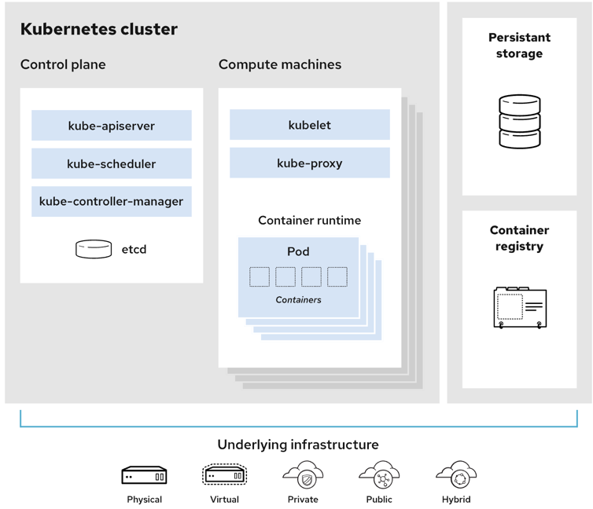
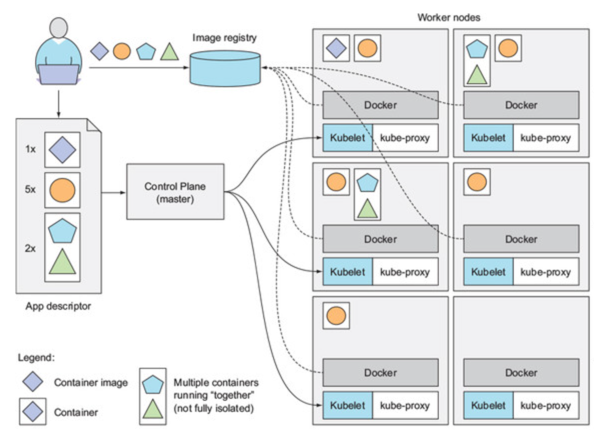

# 쿠버네티스  소개
## 1.1 쿠버네티스와 같은 시스템이 필요한 이유
### 1.1.1 모놀리식 구조에서 마이크로서비스 구조로 전환
옛날에는 소프트웨어 애플리케이션이 monolithic 구조였음. 현재도 레거시 시스템은 이런 경우가 많음.
현대에 와서는 이런 구조가 마이크로서비스라는 독립적으로 실행되는 더 작은 구성 요소로 세분화됨. 그래서 급변하는 비즈니스 요구사항에 맞춰서 서비스를 개발할 수 있게 됨. 
하지만 서비스의 규모가 커지고 점점 늘어나면서 이걸 수동적으로 관리하는 것을 어려운일. 그래서 배포나 구성, 관리, 스케쥴링, 장애 처리를 해줄 수 있는 자동화 과정이 필요 -> 이 역할을 수행하는게 쿠버네티스 
모놀리식 애플리케이션은 서로 강하게 결합되어 있고 전체가 하나의 운영체제 프로세스로 실행되기 때문에 하나의 개체로 개발,배포, 관리 해야함. 따라서 한 부분을 변경하더라도 전체 애플리케이션을 재배포해야하는 문제가 있음.
이러한 구조는 애플리케이션을 실행하는데 많은 리소스를 필요로 하며 서버를 scale-up하거나 scale-out 해야하는데 수직 확장하기엔 비용적 한계와 기술적 한계가 존재하고 수평적 확장하기엔 일부분이 확장이 불가능하면 전체적으로 확장할 수 없음. 
따라서 이러한 경우엔 마이크로서비스로 애플리케이션을 분할하는게 효과적일 수 있음. 각 마이크로서비스는 독립적은 프로세스로 수행되며 API(동기-HTTP, 비동기-AMQP)를 이용하여 다른 마이크로서비스와 통신을 함. 또한, 각 마이크로서비스는 독립적이기 때문에 서로 팀마다 적합한 언어를 사용하여 개발할 수 있음(polyglot의 특징을 갖게 됨.) 
하지만 이러한 마이크로서비스 구조도 단점이 존재하는데 서비스가 적다면 관리가 효율적이지만 반대로 많아지게 되면 구조가 복잡해지게 되고 구성 요소 간의 상호 종속성 수도 늘어나게 됨. 
### 1.1.2 애플리케이션에 일관된 환경 제공
애플리케이션에 일관된 환경도 제공해줘야함. 개발자의 개발환경과 프로덕션 환경(운영팀)의 차이로 인해 원활하게 배포가 이루어지지 않을 수도 있음.
### 1.1.3 지속적인 배포로 전환: 데브옵스와 노옵스
요새는 개발자가 CD까지 같이함. 즉, 개발자, 운영 팀이 전체 프로세스에서 협업해야함-> 이 작업을 수행하는게 Devops. 데브옵스의 장점으로는 애플리케이션의 사용자의 요구사항에 맞춰 자주 릴리스 할 수 있고 배포 프로세스도 간소화시킬 수 있음. 노옵스는 말 그대로 개발자가 운영팀을 거치지 않고 배포까지 직접하는 방식. 
쿠버네티스를 사용하면 이런 것도 고민할 필요없이 하드웨어를 추상화하고 이를 애플리케이션 배포, 실행을 위한 플랫폼으로 자동으로 제공해줌 -> 개발자는 운영팀이 없어도 쉽게 편하고 운영팀도 애플리케이션을 관리하지 않고 오직 인프라만 관리하면 돼서 편함.

## 1.2 컨테이너 기술 소개
쿠버네티스는 애플리케이션을 격리하는 기능을 제공하기 위해 리눅스 컨테이너 기술을 이용.
### 1.2.1 컨테이너 이해
컨테이너는 동일한 host 시스템 내에서 여러 개의 서비스를 실행할 수 있으며 동시에 서로 다른 환경을 만들어줄 뿐만 아니라 가상머신과 유사하게 서로 격리되지만 오버헤드가 적음.
가상 머신을 이용할 경우엔 자체적인 guest os도 필요하므로 리소스도 더 많이 들지만(커널도 분리) 컨테이너 같은 경우에는 하나의 host os를 공유하므로 (하나의 커널을 공유) 시스템 프로세스를 위한 추가적인 컴퓨팅 리소스가 필요하지 않음.
격리할 프로세스가 적을 때 가상 머신을 쓰는게 좋을 수 있지만(자체 리눅스 커널이기 대문에 완전한 격리를 제공하여 보안적 측면에서 우수) 격리할 프로세스 수가 많을 때는 컨테이너가 효율적. 
컨테이너 격리에는 리눅스의 namespace와 cgroups이 이것을 가능하게 하는데 리눅스의 네임스페이스는 동일한 시스템에서 별개의 독립된 공간을 격리된 환경에서 운영하는 가상화 기술임.
네임스페이스의 종류는 총 6가지가 있음.
* NS namespace
  * 파일 시스템의 마운트 지점을 분할 격리
* PID namespace
  * process ID를 분할 관리
* NET namespace
  * 네트워크 인터페이스, iptables 등의 네트워크 리소스와 관련된 정보를 분할
* IPC namespace
  * IPC리소스를 분할 격리
* UTS namespace
  * 호스트와 도메인 네임 별로 격리
* USER namespace
  * user와 group id를 분할하고 격리

쉽게 생각하면 이름을 붙여줘서 분리하는거임. 그래서 이 네임스페이스를 이용해 특정 리소스 그룹을 격리하는데 사용. cgroups은 프로세스의 리소스 사용을 제한하는 기능.
### 1.2.2 도커 컨테이너 플랫폼 소개
도커는 컨테이너를 이미지화해서 간편한 이식 가능한 패키지로 패키징하는 컨테이너 플랫폼으로서 애플리케이션을 쉽게 패키징, 배포, 실행가능하게 함.
도커의 이미지는 여러 이미지에서 공유되고 재사용될 수 있는 레이어로 구성되어 있음. 그래서 동일한 레이어는 또 불러오지 않고 한번만 저장됨.
그렇다면 하나의 컨테이너가 변경사항을 저장하고 덮어쓰기 할때 공유하고 있는 레이어가 덮어쓰기 되냐? 그건 아님. 이미지 레이어는 읽기 전용이기 때문에 컨테이너가 실행될때 이미지 레이어 위에 새로운 쓰기 가능한 레이어가 만들어짐.
세가지 주요 개념
* 이미지 - 애플리케이션과 애플리케이션을 실행시키기 위한 라이브러를 패키지화한 것.
* 레지스트리 - 이미지를 저장할 수 있는 공유 저장소 
* 컨테이너 - 도커 기반 컨테이너 이미지에서 생성된 일반적인 리눅스 컨테이너

### 1.2.3 도커의 대안으로 rkt 소개
도커는 리눅스 컨테이너를 리눅스 네임스페이스와 cgroups을 이용하여 컨테이너 격리를 쉽게하는애임. 즉 도커가 아니더라도 다른 컨테이너 런타임이 이용될 수가 있음.
쿠버네티스에는 1.24버전부터 Dockershim이 제거됨.  
`https://kubernetes.io/docs/tasks/administer-cluster/migrating-from-dockershim/check-if-dockershim-removal-affects-you/`  
`OCI(Open Container Initiative)는 컨테이너 런타임에 대한 표준으로 컨테이너를 실행하기 위한 저수준 런타임.`  
`CRI(Container Runtime Interface)는 쿠버네티스 측에서 제공하는 컨테이너 런타임 추상화 계층.`  
`CRI-O 는 CRI+OCI에서 유래되었고 컨테이너 실행을 목적으로 도커보다 경량화되어 있고 컨테이너 생성인 run과 이미지 빌드를 제공하지 않음. 혼자 동작하지 않아서 k82나 podman(이미지 빌드 tool)과 함께 사용.`  
쿠버네티스는 컨테이너 런타임과 통신할 때 CRI라는 표준 인터페이스 API를 사용하는데 도커는 이를 지원하지 않기 때문에 둘을 잇는 도구로 dockershim이 사용되었는데 이게 한번 거쳐서 가다보니 배포 속도도 느리고 유지 관리도 힘듬.
-> 컨테이너 런타임으로 Containerd가 채택됨. 이거 말고도 컨테이너 런타임 종류가 더 있음. CRI-O, 도커 엔진, 미란티스 컨테이너 런타임 (CRI 요구사항을 만족하는 런타임.)
## 1.3 쿠버네티스 소개
### 1.3.1 쿠버네티스 기원
이전부터 구글 자체 내에서 구글은 보그와 오메가라는 프로젝트를 개발해 애플리케이션 개발자와 시스템 관리자가 여러 개의 애플리케이션과 서비스를 관리하는 데 사용해옴. 단순히 Borg는 Large-scale cluster를 management한것이고 Omega는 scalable schedulers인거만 알면 될듯.
### 1.3.2 넓은 시각으로 쿠버네티스 바라보기
쿠버네티스는 컨테이너화된 애플리케이션을 쉽게 배포하고 관리할 수 있게 해주는 소프트웨어 시스템으로 시스템은 마스터노드와 워커노드로 구성되어 있음. 개발자가 manifest를 마스터 노드에게 post하면 쿠버네티스는 해당 애플리케이션을 워커 노드 클러스터에 배포.
개발자는 쿠버네티스가 알아서 인프라와 관련된 서비스 디스커버리, 스케일링, 로드밸런싱, 자가 치유, 리더 선출 같은 것들을 제공해주고 때문에 애플리케이션의 실제 기능을 구현하는데만 집중하면 됨.
### 1.3.3 쿠버네티스 클러스터 아키텍쳐의 이해

마스터 노드는 전체 쿠버네티스 시스템을 제어하고 관리하는 쿠버네티스에서 control plane으로 불리는 역할을 수행하며 워커 노드는 실제 배포되는 컨테이너 애플리케이션을 실행하는 역할을 한다. 
컨트롤 플레인은 api서버(사용자, 컨트롤 플레인 구성 요소와 통신하는 역할)와 스케쥴러(애플리케이션의 배포를 담당), 컨트롤러 매니저(구성 요소 복제본, 워커 노드 추적, 노드 장애 처리 등과 같은 클러스터단의 기능 수행), etcd(클러스터 구성을 지속적으로 저장하는 신뢰할 수 있는 분산 데이터 저장소)로 구성되어 있다. 
워코 노드는 컨테이너 런타임(컨테이너를 실행하는), kubelet(api 서버와 통신하고 노드의 컨테이너를 관리하는 역할), kube-proxy(애플리케이션 구성 요소 간에 네트워크 트래픽을 로드밸런싱하는 역할)로 이루어져있음.
### 1.3.4 쿠버네티스에서 애플리케이션 실행
쿠버네티스에서 애플리케이션을 실행시키기 위해선 쿠버네티스 api서버에 디스크립션을 post해야하는데 여기에는 컨테이너 이미지, 애플리케이션 구성 요소가 포함된 이밎, 해당 구성 요소가 통신하는 방법, 동일 서버에 함께 배치돼야 하는 구성 요소, 복제본 수 , 내부 또는 외부와 통신할 서비스 등을 포함. 

api서버가 디스크립션을 처리할때 스케쥴러는 각 컨테이너에 필요한 리소스를 계산하고 워커노드에 지정된 컨테이너를 할당함. 그런 다음 해당 노드의 kubelet은 컨테이너 런타임에 필요한 컨테이너 이미지를 가져와 컨테이너를 실행하도록 지시. 컨테이너 런타임이 이제 컨테이너를 띄워서 애플리케이션을 실행시키면 쿠버네티스는 이후 배포 상태를 처음 받았던 디스크립션과 일치하는지 지속적으로 확인
-> desired state라고 불리는 상태로 계속 유지. 만약 노드가 못쓰게 되면 다른 노드로 스케쥴링해주고 그럼. 또한, 필요한 경우 복제본 수를 조정해서 스케일링 할 수 있고 실시간 메트릭을 기반으로 복제본 수를 자동으로 조정(오토 스케일링)할 수 있음.  
앞에서 노드 하나의 비정상일 경우 다른 노드에 다시 컨테이너가 스케쥴링되는 부분에서 사용자가 해당 서비스에 접근하기 위해선 외부와의 접속을 위한 Service를 이용하면 항상 고정된 ip와 포트로 사용자는 서비스에 접근할 수 있고 내부적으로 쿠버네티스가 알아서 서비스를 로드 밸런싱하고 디스크립션 상태를 유지함. 
쿠버네티스는 알아서 애플리케이션의 리소스 요구 사항에 대한 디스크립션과 각 노드에서 사용 가능한 리소스에 따라 실행할 가장 적합한 노드를 선택할 수 있음
## 요약
